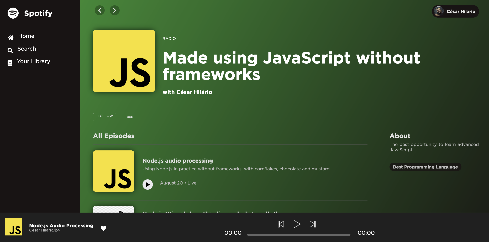

# Spotify Radio

Spotify clone made with JavaScript **without frameworks**

## Preview

## Checklist Features

    - [ ] Must achieve 100% code coverage in tests
    - [ ] Must have end to end tests validating all API routes
    - [X] Must deliver static files as Node.js Streams
    - [ ] Must deliver music files as a Node.js Stream
    - [ ] Given a disconnected user it should not break the API
    - [ ] Even if multiple commands are fired at the same time, it should not break the API
    - [X] If an unexpected error occurs, the API should keep working
    - [ ] The project needs to run on Linux, Mac and Windows environments

- Web App
  - Client
    - [ ] Must play the broadcast
    - [ ] Shouldn't pause if any effects are added
  - Controller
    - [ ] Must achieve 100% code coverage in tests
    - [ ] Must be able to start or stop a broadcast
    - [ ] Must send commands to add audio effects to a stream

### Credits

#### Transmission

- [English Conversation](https://youtu.be/ytmMipczEI8)

#### Effects

- [Applause](https://youtu.be/mMn_aYpzpG0)
- [Applause Audience](https://youtu.be/3IC76o_lhFw)
- [Boo](https://youtu.be/rYAQN11a2Dc)
- [Fart](https://youtu.be/4PnUfYhbDDM)
- [Laugh](https://youtu.be/TZ90IUrMNCo)
